# Module 1: Twinfra system topology and flow contract

**Design date:** 2026-10-05. **Status:** Proposed integration architecture; component
choices are required by Module 1. No Module 1 service or bursting adapter had been
deployed at that design revision. Current lab receipts and superseding owner decisions
are recorded in the ADR log. [SSoT v2.2](../vcloud-ssot.yaml) supplies the platform identity and hard
constraints; [17 component ADRs](adr/README.md) supply the implementation decisions.

The user-facing chain is **APISIX → Knative → RAG application → vLLM**, with **pgvector
retrieval owned by the RAG application**. A literal `vLLM → pgvector` database call would
put retrieval in the wrong component. The embedding vLLM endpoint produces a query
vector; LangChain uses it to query pgvector before requesting generation. See
[LangChain's vector-store integration](https://docs.langchain.com/oss/python/integrations/vectorstores/pgvectorstore)
and [vLLM serving](https://docs.vllm.ai/en/stable/serving/online_serving/).

## Textual infographic: interactive RAG

```text
 Client -- OIDC login --> Keycloak (auth.vcloud.example.com)
   |
   | HTTPS + access token; POST /v1/rag
   v
 APISIX (api.vcloud.example.com)
   | validate identity, audience/scopes; enforce API limits
   | private upstream + reviewed Knative Host header
   v
 Kourier: Knative ingress adapter
   | --> Activator when activation/buffering is needed --+
   |                                                   |
   +---------------------------------------------------+
   v
 Knative queue-proxy --> LangChain RAG application [same application pod]
                          |
                          +-- 1. Embed query --> vLLM embedding endpoint
                          |                     <-- query vector
                          |
                          +-- 2. Authorized SQL --> PostgreSQL + pgvector
                          |                        <-- permitted chunks
                          |
                          +-- 3. Augmented prompt --> vLLM generation endpoint
                                                  <-- generated token stream
                          |
                          +-- 4. Answer + authorized source references
                                   --> queue-proxy / Knative --> APISIX --> Client

 PostgreSQL lifecycle: CloudNativePG; secrets: OpenBao; identity: Keycloak
 Async ingestion/HPC: Kafka + Strimzi; delivery: Tekton --> Registry/Git --> Argo CD
 Telemetry: OpenTelemetry --> selected trace backend; Prometheus --> Perses
 Dashboards: Perses (read-only, Git-provisioned); Keycloak SSO via APISIX
 HPC: admission --> proposed capacity adapter --> Spinifex/cloud --> execution cluster
```

Kourier forwards either through Activator or directly to the revision's queue-proxy;
Activator is not an obligatory hop for every request. See
[Knative request flow](https://knative.dev/v1.21-docs/serving/request-flow/).
Transport encryption is an intended acceptance condition. Knative internal TLS remains
experimental in current documentation, and additional certificate integrations and
control-path review are required; this diagram is not evidence that those hops already
provide encryption. See
[the encryption overview](https://knative.dev/docs/serving/encryption/encryption-overview/).

## Mermaid: complete platform overview

Solid arrows show logical requests, events, artifacts or telemetry. Dashed arrows
show reconciliation/ownership. A metrics arrow denotes data received after scraping;
the traffic matrix below identifies the actual connection initiator. An arrow never
grants a network permission. Bracketed dependencies remain to be implemented/selected.
All service placement shown is intended placement, subject to release-specific namespace
and Pod Security validation in the ADR index.

```mermaid
flowchart TB
    CLIENT["Users and operators"]
    GIT["Git: amazen33/twinfra"]
    REG["Registry: registry.vcloud.example.com"]
    ART["Authorized object / model / result storage [dependency]"]
    BACKUP["Off-cluster encrypted backup storage [dependency]"]
    TRACE["Persistent trace backend [selection required]"]

    subgraph CLUSTER["Kubernetes: vCloud-prod-01 | Ubuntu 24.04 | containerd | Cilium native eBPF"]
        API["Kubernetes API / reconciliation"]
        RUNTIME["Worker kubelet / containerd runtime"]

        subgraph PLATFORM["platform-services | default deny ingress and egress"]
            APISIX["APISIX: TLS entry / OIDC / API limits"]
            KEYCLOAK["Keycloak: human IAM / OIDC"]
            BAO["OpenBao: workload auth / short-lived secrets"]
            KNCTRL["Knative Serving controller / autoscaler"]
            KOURIER["Private Kourier gateway"]
            ACTIVATOR["Knative Activator: conditional hop"]
            CNPG["CloudNativePG operator"]
            PG["PostgreSQL: primary + standbys / pgvector"]
            STRIMZI["Strimzi operator"]
            KAFKA["Apache Kafka: KRaft / ingestion + job events"]
            TEKTON["Tekton: CI / verification / provenance"]
            ARGO["Argo CD: reviewed Git reconciliation"]
            OTEL["OpenTelemetry gateway Collector"]
            PROM["Prometheus: metrics / alert rules"]
            PERSES["Perses: read-only dashboards / Keycloak SSO via APISIX"]
        end

        subgraph APPS["workload-apps | restricted pods / default deny"]
            QP["Knative queue-proxy"]
            RAG["LangChain RAG API: retrieval + prompt assembly"]
            INGEST["Document ingestion / embedding worker"]
            OUTBOX["Transactional outbox publisher [implementation]"]
            JAPI["Authenticated asynchronous job API [implementation]"]
        end

        subgraph HPC["hpc-compute | GPU / batch quotas / default deny"]
            EMBED["vLLM: pinned embedding model"]
            GEN["vLLM: pinned generation model / warm capacity"]
            ADMIT["Kueue / job admission integration [implementation]"]
            ADAPTER["Capacity / execution adapter [implementation]"]
            JOB["Admitted local HPC job / GPU workers"]
        end
    end

    subgraph INFRA["Separate infrastructure trust domain"]
        SPINIFEX["Spinifex cloud APIs / dedicated hypervisor hosts"]
        CLOUD["Approved public-cloud capacity APIs"]
        REMOTE["Registered remote Kubernetes execution cluster"]
        PROVISION["Single infrastructure reconciler [implementation]"]
    end

    CLIENT -->|"HTTPS / bearer token"| APISIX
    CLIENT -->|"OIDC login"| KEYCLOAK
    APISIX -->|"OIDC discovery / keys"| KEYCLOAK
    APISIX -->|"Keycloak SSO / read-only dashboards"| PERSES
    APISIX -->|"Private route / correct Host"| KOURIER
    KOURIER -->|"Cold / buffering path"| ACTIVATOR
    ACTIVATOR --> QP
    KOURIER -->|"Ready-capacity path"| QP
    QP --> RAG
    RAG -->|"1. Query embedding"| EMBED
    EMBED -->|"Query vector"| RAG
    RAG -->|"2. Tenant-authorized retrieval"| PG
    PG -->|"Authorized chunks"| RAG
    RAG -->|"3. Augmented prompt"| GEN
    GEN -->|"4. Token stream"| RAG
    RAG -->|"Answer via Knative and APISIX"| CLIENT

    APISIX -->|"Scoped secret reads"| BAO
    RAG -->|"Workload auth / DB lease"| BAO
    BAO -->|"Credential lifecycle"| PG
    KEYCLOAK -->|"Dedicated identity database"| PG
    PG -->|"WAL / base backup via reviewed integration"| BACKUP

    PG -->|"Committed outbox rows"| OUTBOX
    OUTBOX -->|"Versioned durable events"| KAFKA
    KAFKA -->|"Document events / replay"| INGEST
    INGEST -->|"Authorized source objects"| ART
    INGEST -->|"Chunk embeddings"| EMBED
    INGEST -->|"Idempotent vectors / ACL metadata"| PG
    APISIX -->|"Authenticated asynchronous job route"| JAPI
    JAPI -->|"Job state + outbox transaction"| PG
    KAFKA -->|"Job intent"| ADMIT
    ADMIT -->|"Quota / admission coordination"| ADAPTER
    ADMIT -.->|"Admit after capacity ready"| JOB
    ADAPTER -->|"Bounded provider request"| PROVISION
    PROVISION --> SPINIFEX
    PROVISION --> CLOUD
    SPINIFEX -.->|"Provision registered site capacity"| REMOTE
    CLOUD -.->|"Provision registered site capacity"| REMOTE
    ADAPTER -->|"Idempotent remote job / status"| REMOTE
    REMOTE -->|"Authorized data / verified results"| ART
    JOB -->|"Authorized data / verified results"| ART
    ADAPTER -->|"Completion / failure events"| KAFKA

    GIT -->|"Exact source revision"| TEKTON
    TEKTON -->|"Verified image digest / provenance"| REG
    TEKTON -->|"Reviewed digest-change PR"| GIT
    GIT -->|"Reviewed desired state"| ARGO
    ARGO -.->|"Apply intent"| API
    ARGO -.->|"Git-provisioned read-only dashboards"| PERSES
    API -.-> CNPG
    CNPG -.->|"DB lifecycle"| PG
    API -.-> STRIMZI
    STRIMZI -.->|"Kafka lifecycle"| KAFKA
    API -.-> KNCTRL
    KNCTRL -.->|"Revision / HTTP capacity"| QP
    API -.->|"Runtime scheduling"| GEN
    API -.->|"Pod assignment"| RUNTIME
    REG -->|"Approved image pulls"| RUNTIME
    ART -->|"Pinned model weights on CSI storage"| GEN
    ART -->|"Pinned embedding weights on CSI storage"| EMBED

    RAG -->|"Redacted OTLP"| OTEL
    APISIX -->|"Approved telemetry"| OTEL
    ADAPTER -->|"Redacted OTLP"| OTEL
    OTEL -->|"Sampled traces"| TRACE
    OTEL -->|"Scraped application metrics"| PROM
    PG -->|"Scraped metrics"| PROM
    KAFKA -->|"Scraped metrics"| PROM
    GEN -->|"Scraped metrics"| PROM
    PERSES -->|"Read-only metric queries"| PROM
    ARGO -->|"Operator OIDC"| KEYCLOAK
```



Registry arrows represent the node-runtime image-pull dependency. Model artifact arrows represent staging
to CSI volumes; pods do not obtain unapproved arbitrary external egress.
The job API is reached through an APISIX route; its placement as a separate HTTP service
or Knative Service is a later implementation choice. Returning an answer to the client
always traverses the reverse established Knative/APISIX path.
The PostgreSQL node groups the database capability logically; it can represent separate
application and infrastructure clusters with distinct credentials and failure isolation.
Perses dashboard definitions are provisioned from Git through Argo CD, with no dedicated
configuration database. Read-only dashboard access uses Keycloak SSO enforced by APISIX.

## Ownership and trust boundaries

| Plane | Writer/authority | Explicit boundary |
| --- | --- | --- |
| Human identity | Keycloak | OIDC roles do not automatically grant Kubernetes/OpenBao/cloud permissions |
| Workload identity/secrets | Kubernetes service accounts + OpenBao roles | Namespace/name/audience-bound policies; short leases |
| Network | Cilium policies + reviewed site routing | Default deny; namespace placement alone does not grant connectivity |
| External API | APISIX | Authentication/API controls; application still enforces tenant/document permissions |
| HTTP revision capacity | Knative | Owns revisions and CPU service replicas; GPU model capacity remains separate |
| Database lifecycle | CloudNativePG | Primary/standby lifecycle; read-capacity controller gets only delegated instance count |
| Kafka lifecycle | Strimzi | Generated broker/controller resources; Git owns custom-resource intent |
| Build/artifact intent | Tekton + approved signer/verifier | No direct production deployment permission for build code |
| Kubernetes desired state | Argo CD | Only reviewed repository/projects/destinations; safe stateful deletion policy |
| HPC admission | Kueue/job-framework integration | Quotas and complete job/gang placement; proposed implementation |
| Infrastructure capacity | One provider reconciler | Spinifex/cloud APIs and VM state; distinct from Kubernetes workload reconciliation |
| Telemetry | OTel / Prometheus / selected backends | Redacted data, bounded cardinality/queues; no telemetry-store secrets in workloads |

The approved [node exception](adr/0001-node-host-mounts.md) covers its pinned bootstrap
components only. New CSI node drivers, hypervisor services, privileged collectors and
build engines require their own inventory/justification if they need host access.

## Connection allowlist to implement

These are **design requirements**, not executable policies. Each row becomes a narrow
source-service-account/pod-selector and destination rule, on both ingress and egress
where required. Resolve actual Pod target ports from pinned manifests and include
approved health checks. Service ports and endpoints below are design endpoints;
verify target-port mappings before writing policies. Do not allow a whole namespace
or all Internet egress to make an integration pass.

| Connection initiator | Destination | Protocol / service port | Purpose and restriction |
| --- | --- | --- | --- |
| External client | APISIX public load balancer | HTTPS 443 | API entry; route-specific OIDC and limits |
| External client | Published Keycloak realm paths | HTTPS 443 | Login/refresh; private admin endpoints excluded |
| APISIX | Keycloak issuer/discovery/JWKS | HTTPS 443, or reviewed private TLS target | Verify issuer/CA; fixed domains and paths |
| APISIX | Private Perses service | HTTP 8080; gateway terminates TLS | Keycloak SSO and console roles at the gateway; read-only dashboards; no direct public access |
| APISIX | Private Kourier gateway | HTTPS; pinned release target port | Knative Host routing; no direct revision bypass |
| Kourier / Activator | Activator / revision queue-proxy | Knative system TLS; pinned release ports | Conditional activation; experimental-feature acceptance gate |
| Queue-proxy | Application container in the same pod | Loopback; configured app port | Pod-local HTTP contract; no general namespace allowance |
| RAG / ingestion worker | Private vLLM embedding service | HTTPS 443 via reviewed non-root TLS endpoint | Model/task/dimension-specific embeddings |
| RAG | Private vLLM generation service | HTTPS 443 via reviewed non-root TLS endpoint | Scoped workload auth, token budgets and streaming |
| RAG / ingestion / job API / outbox publisher | PostgreSQL or scoped connection pool | PostgreSQL TLS 5432 | Distinct roles; tenant-filtered/RLS queries; read/write endpoints explicit |
| Keycloak | Its dedicated PostgreSQL database/role | PostgreSQL TLS 5432 | Infrastructure data; separate ownership from RAG tables |
| OpenBao | PostgreSQL credential-management endpoint | PostgreSQL TLS 5432 | Only approved role creation/rotation/revocation SQL |
| PostgreSQL instances / approved poolers | Peer DB instances | PostgreSQL TLS 5432 | Replication/connection handling; exact Cluster identities |
| Approved workload agents/SDKs | OpenBao | HTTPS 8200 | Bound workload identities and secret paths |
| OpenBao members | OpenBao cluster peers | TLS 8201 | Raft/cluster traffic; exact members only |
| Kafka producers/consumers | Scoped Kafka listeners and advertised broker addresses | TLS 9093, if selected by pinned config | Topic/group ACLs; all discovered brokers remain private |
| Kafka brokers/controllers | Cluster peers | Authenticated TLS; pinned listener ports | KRaft quorum/replication; no plaintext/anonymous listener |
| OTel-instrumented clients | Gateway Collector | TLS OTLP gRPC 4317 or HTTP 4318 | Only configured sender identities/protocols |
| Prometheus | Approved metrics exporters / Collector | Authenticated HTTP(S); exact exporter target ports | Scrape identities; no generic all-pod scrape permission |
| Perses | Prometheus | HTTPS; selected proxy/backend ports | Read-only operator data-source credentials |
| Collector | Selected trace/log backend | TLS; selected export ports | Redaction, retention and data residency contract |
| Selected controllers / OpenBao reviewer | Kubernetes API | TLS 6443 locally; verified provider endpoint in cloud | Least-privilege RBAC; projected tokens; exact destination |
| API server | Approved admission webhooks | TLS; pinned webhook ports | Named webhook service identities; availability policy reviewed |
| Approved pods | Cluster DNS resolver | UDP/TCP 53 to exact DNS endpoints | DNS only; DNS query permission does not allow subsequent destinations |
| Node container runtime | Canonical registry | HTTPS 443 | Scoped pull credentials, staged pinned images; host egress reviewed separately |
| Tekton / Argo CD | Approved Git/artifact endpoints | HTTPS 443 | Repository identities, trusted CA, authenticated triggers/reviewed commits |
| Ingestion / authorized jobs / artifact staging | Approved object/model/result store | HTTPS 443 or verified private storage endpoint | Object/tenant-scoped credentials; residency constraints |
| Backup integration | Off-cluster backup store | Verified TLS; selected endpoint | WAL/base backups, encryption and restore credentials |
| HPC capacity adapter / infrastructure reconciler | Spinifex / selected cloud APIs | Verified TLS; provider-specific endpoint ports | Least-privilege provider role, quotas and idempotent requests |
| Execution adapter | Registered remote Kubernetes API | Verified TLS; registered endpoint | Site-scoped job identity; no cluster-admin federation |

Keycloak HA/cache discovery, Argo/Tekton/Knative internal control traffic, exporter
authentication proxies and health probes also need release-specific rules. The matrix
cannot be converted into safe policies until those ports and service identities are
inventoried. External CA/DNS automation and alert destinations receive only the permissions
actually needed. Cilium native routing requires verified node PodCIDR reachability at
each site; cross-site private connectivity does not imply a stretched Cilium cluster.

## Asynchronous document and HPC flow

1. A permitted upload/job submission commits metadata, durable state and an outbox row
   in one PostgreSQL transaction. The outbox publisher sends a versioned Kafka event.
   Event IDs and operation IDs make publishing/consumption replay safe.
2. Document consumers fetch authorized source objects, chunk them, obtain embeddings
   and upsert pgvector rows plus ACL metadata. A generation model is not an embedding
   substitute. Deletion/re-index events obey the same tenant and retention contract.
3. The proposed job/admission adapter checks tenant authorization, queue limits,
   required GPUs/fabric/runtime and budget. It chooses local admitted capacity or a
   registered cloud/site. Kueue admission and infrastructure provisioning are coordinated
   explicitly; neither Kafka nor Spinifex independently schedules Kubernetes pods.
4. A single infrastructure reconciler obtains approved capacity through Spinifex or
   provider APIs. It registers and verifies the execution environment, images, CSI,
   credentials and routes before an admitted job is submitted with a durable idempotency key.
5. Execution reports update durable job state and publish Kafka status events. Result
   references point to authorized object storage. Recovery reconstructs execution ownership
   after a controller outage; cleanup removes only completed/orphaned leased resources.

Kafka effects outside Kafka require application coordination, not an assumed global
exactly-once guarantee. See [Kafka semantics](https://kafka.apache.org/41/design/design/).
Spinifex's documented Kubernetes provisioning supplies an infrastructure capability;
the admission/capacity/job bridge described here remains to be implemented and proven.
See [Spinifex EKS provisioning](https://docs.mulgadc.com/docs/eks-quickstart).

## Scaling and recovery contract

| Layer | Intended scaling | Safety floor / recovery dependency |
| --- | --- | --- |
| CPU RAG API | Knative concurrency/RPS policy with bounded replicas | Warm minimum when cold-start SLO demands it; version rollback |
| GPU generation/embedding | Separate measured queue/token policies | Whole-GPU quota, model readiness, warm serving reservation |
| PostgreSQL | Guarded read-instance policy; planned primary resource/storage growth | Minimum/quorum/lag floors, operator sequencing, independent WAL/PITR recovery |
| Kafka | Planned broker expansion and partition reassignment | Controller quorum, ISR/replication bounds, retention/recovery plan |
| HPC | Admission quotas plus proposed capacity adapter | Whole-job placement, provider budget, durable ownership and cleanup |
| Telemetry | Bounded Collector capacity and metric retention | Backpressure/sampling, drop visibility; no unbounded request blocking |

CloudNativePG does not automatically scale PostgreSQL writes. Generic CPU HPA is
discouraged upstream; the custom read-capacity policy is an additional integration.
VPA remains recommendation-only. See
[the upstream constraints](https://cloudnative-pg.io/docs/1.28/resource_management/).
OpenTelemetry and Perses do not supply trace storage by themselves; a retained trace
backend is explicitly outstanding. See
[Collector architecture](https://opentelemetry.io/docs/collector/architecture/).

## Release and operational acceptance

Before production operation, record exact component/chart/model pins and artifact
digests, supported API/CRD schemas, storage/failure-domain placement, TLS issuance/trust
rotation, declared SLOs and limits, and the approved connection rules. Run strict
kubeconform on every rendered manifest and review generated pods/sidecars against
the root/host-volume constraints. No deployable Kubernetes manifest is included in
this documentation module, so these are future implementation gates rather than
claimed kubeconform results.

Exercise authenticated RAG end to end; unauthorized tenant access; IdP/OpenBao outage;
secret rotation; ingestion replay; PostgreSQL failover/PITR; Kafka loss/recovery;
GPU failure and streaming cancellation; and a bounded local/cloud HPC job through
completion and cleanup. Record static evidence separately from live results.
The [recruiter summary](module-1-summary.md) describes the work as architecture design.
